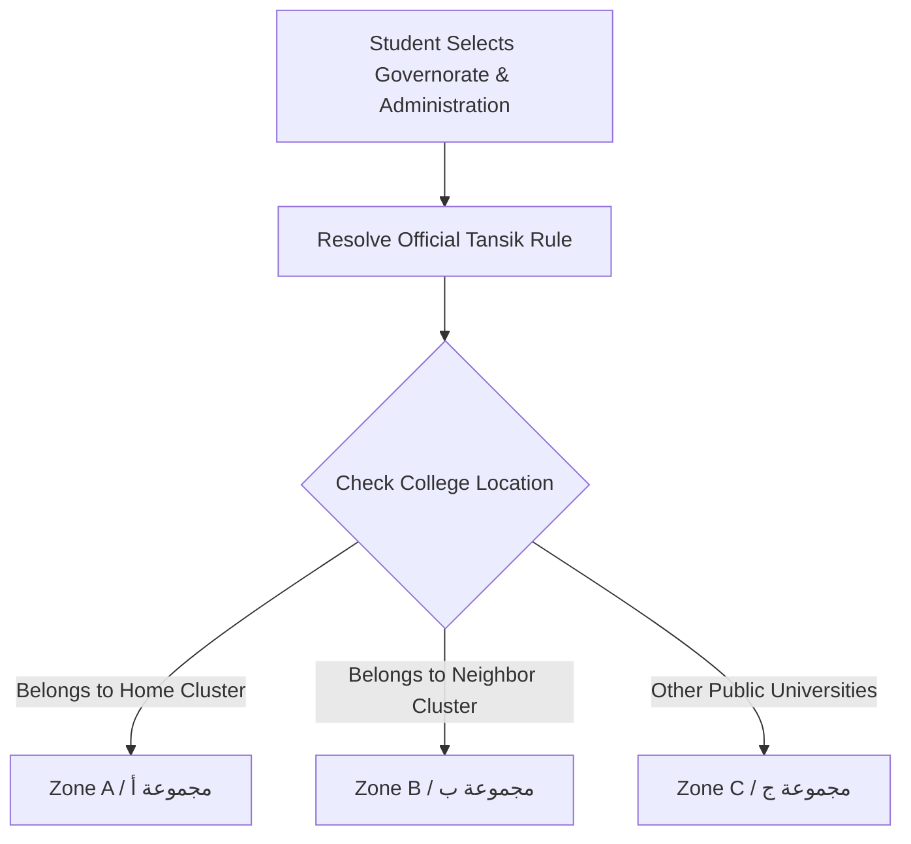
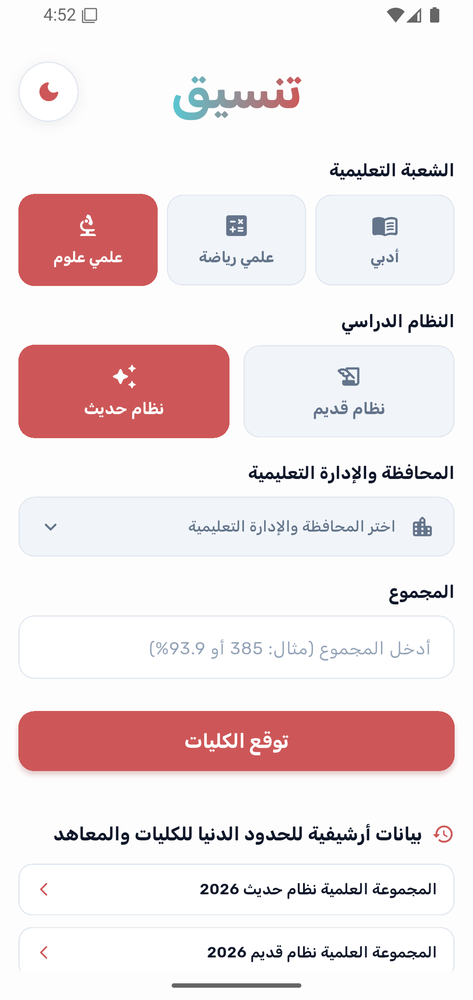
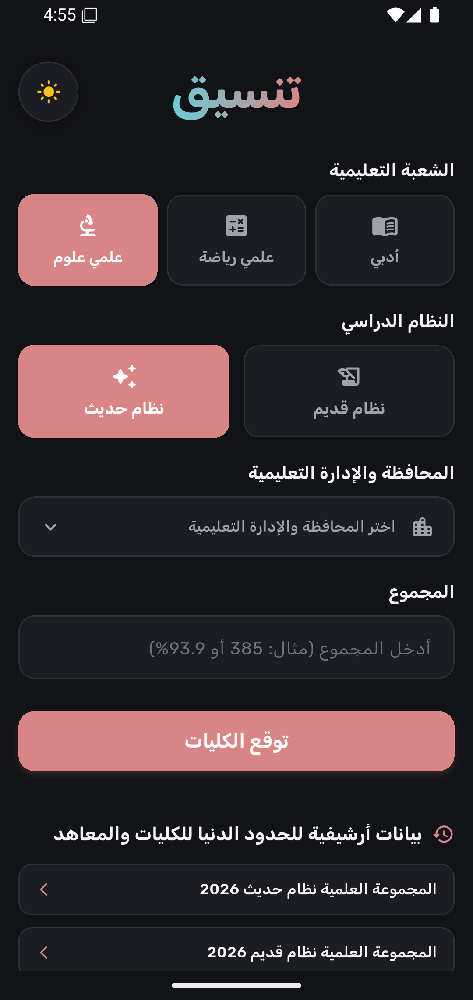
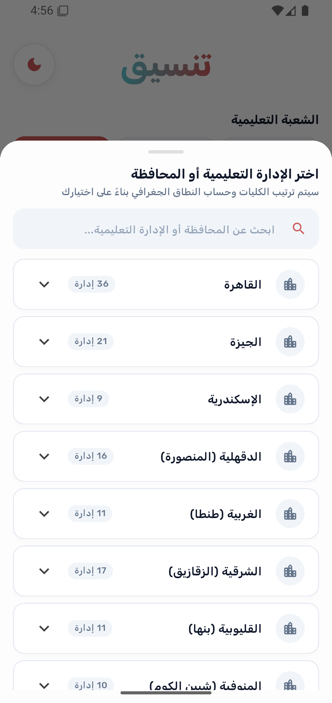
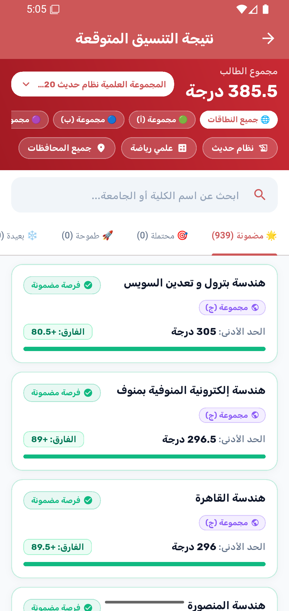
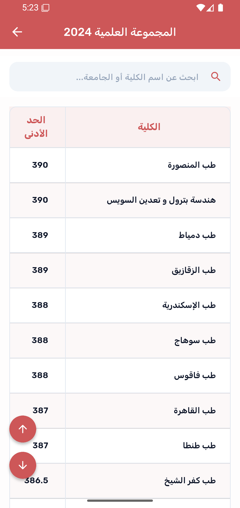

<p align="center">
  <h1 align="center">🎓 تنسيق | Tansik</h1>
  <p align="center">
    <strong>Smart University Admission & Geographic Distribution Predictor for Egyptian Thanaweya Amma Students</strong>
    <br />
    <em>تطبيق متقدم ومبتكر لتوقع الكليات والمعاهد والحدود الدنيا لطلاب الثانوية العامة في مصر وفقاً لقواعد التوزيع الجغرافي الرسمية</em>
  </p>
</p>

<p align="center">
  <a href="https://flutter.dev"></a>
  <a href="https://dart.dev"></a>
  <a href="https://bloclibrary.dev"></a>
  <a href="https://github.com/Ahmed-Moataz-glitch/Tansik/blob/master/LICENSE"></a>
  
  
</p>

---

## 📖 Table of Contents

- [Overview](#-overview)
- [Key Features](#-key-features)
- [How It Works & Algorithms](#-how-it-works--algorithms)
  - [1. Recommendation Engine (Classification & Tiering)](#1-recommendation-engine-classification--tiering)
  - [2. Official Geographic Distribution Engine (Zones أ, ب, ج)](#2-official-geographic-distribution-engine-zones-أ-ب-ج)
  - [3. Real-Time Web Scraping](#3-real-time-web-scraping)
- [Screenshots & UI Showcase](#-screenshots--ui-showcase)
- [Architecture & Folder Structure](#-architecture--folder-structure)
- [Tech Stack & Dependencies](#-tech-stack--dependencies)
- [Getting Started](#-getting-started)
  - [Prerequisites](#prerequisites)
  - [Installation & Running](#installation--running)
  - [Building for Production](#building-for-production)
- [Project Configuration](#-project-configuration)
- [Contributing](#-contributing)
- [License & Author](#-license--author)

---

## 🌟 Overview

**Tansik (تنسيق)** is an all-in-one Flutter mobile application tailored for Egyptian **Thanaweya Amma (الثانوية العامة)** high school graduates. Every year, hundreds of thousands of students face the daunting challenge of navigating the Egyptian university coordination process (تنسيق الجامعات المصرية), attempting to match their final grades and percentages with admission thresholds while adhering to strict geographic distribution rules.

**Tansik** simplifies this process by combining:
1. **Intelligent Predictive Analytics**: Categorizes colleges into 4 realistic likelihood tiers based on historical admission data.
2. **Official Ministry Geographic Distribution**: Dynamically calculates **Group A (أ)**, **Group B (ب)**, and **Group C (ج)** zones according to the student's specific Educational Administration (*الإدارة التعليمية*).
3. **Live Web Scraping & Historical Database**: Scrapes real-time and archived minimum admission scores (*الحدود الدنيا للكليات والمعاهد*) directly from the official portal (`tansik.digital.gov.eg`) spanning from **2022 to 2026**.

---

## ✨ Key Features

### 🎯 1. Intelligent College Predictor (توقع الكليات)
- **4 Dynamic Acceptance Tiers**:
  - 🟢 **مضمونة (Guaranteed)**: Difference $\ge 0.0$ (Score meets or exceeds the required threshold).
  - 🔵 **محتملة (Likely)**: $-1.0 \le \text{Difference} < 0.0$ (Close to threshold, high chance of admission).
  - 🟠 **طموحة (Ambitious)**: $-3.0 \le \text{Difference} < -1.0$ (Slightly higher score required, good reach option).
  - ⚪ **بعيدة (Far)**: $\text{Difference} < -3.0$ (Requires significantly higher score).
- **Flexible Score Input**: Supports raw total scores (e.g., out of 410) and percentages (%) with bidirectional normalization.
- **Academic Track Specialization**:
  - 🧬 **علمي علوم (Scientific - Biology/Science)**: Automatically filters out pure mathematics and engineering faculties.
  - 📐 **علمي رياضة (Scientific - Mathematics)**: Filters out medical, dental, pharmacy, and veterinary faculties while prioritizing engineering, computer science, and technology.
  - 📚 **أدبي (Literary)**: Focuses on humanities, economics, political science, languages (Alsun), mass communication, and law.
- **Educational System Support**: Supports both **النظام الحديث (New System)** and **النظام القديم (Old System)**.

### 📍 2. Official Egyptian Geographic Distribution (التوزيع الجغرافي الرسمي)
- **Comprehensive Database**: Contains all 27 Egyptian Governorates and their respective Educational Administrations (الإدارات التعليمية).
- **Official Zone Calculations**:
  - 🥇 **المجموعة (أ) - النطاق الجغرافي الأول**: Mandatory nearest universities directly associated with the student's educational administration.
  - 🥈 **المجموعة (ب) - النطاق الجغرافي الثاني**: Regional universities adjacent to Group A.
  - 🥉 **المجموعة (ج) - النطاق الجغرافي الثالث**: All remaining Egyptian public universities.
- **Dynamic Sorting & Filtering**: Sort recommendations by geographic proximity (أ ثم ب ثم ج), score difference, or filter specifically by a single zone.

### 🌐 3. Real-Time Scraping & Historical Archives (أرشيف الحدود الدنيا)
- **Live Scraper**: Scrapes tabular admission limits with automated HTML entity decoding, sanitization, and fallback strategies.
- **Multi-Year Archive**: Full data access for years **2026, 2025, 2024, 2023, and 2022**.
- **Search & Quick Navigation**: Instant in-memory search bar and Floating Action Buttons (Scroll to Top / Bottom) for navigating through hundreds of faculties effortlessly.

### 🎨 4. Modern UI & Theme System (الوضع الليلي والنهاري)
- **Material 3 Design**: Styled using `FlexColorScheme` with custom *Rich Crimson / Mandy Red* branding.
- **Dark & Light Modes**: Smooth animated toggle with local state persistence via `SharedPreferences`.
- **RTL & Custom Arabic Typography**: Full Right-to-Left (RTL) support with curated Arabic font families (`Rubik`, `Almarai`, `Noto Naskh Arabic`).
- **Responsive Screen Adaptation**: Powered by `flutter_screenutil` to provide a consistent experience across all screen sizes and aspect ratios.

### 📡 5. Offline Connectivity Management
- **Network Awareness**: Listens to connectivity changes with `flutter_offline`.
- **Smooth Feedback**: Displays an interactive full-screen Lottie animation (`no_internet.json`) when connection drops.
- **Toast Notifications**: Modern toast alerts using `toastification`.

---

## 🧠 How It Works & Algorithms

### 1. Recommendation Engine (Classification & Tiering)

Given a student's score $S$ and the faculty's required admission grade $R$:

$$\Delta = S_{\text{effective}} - R$$

```dart
if (diff >= 0.0) {
  category = RecommendationCategory.guaranteed; // 🟢 مضمونة
} else if (diff >= -1.0) {
  category = RecommendationCategory.likely;     // 🔵 محتملة
} else if (diff >= -3.0) {
  category = RecommendationCategory.ambitious;  // 🟠 طموحة
} else {
  category = RecommendationCategory.far;        // ⚪ بعيدة
}
```

*Grade Normalization:* When comparing percentage inputs ($\le 100$) with historical score thresholds ($> 100$), the system normalizes the score:

$$S_{\text{effective}} = \left(\frac{S}{100}\right) \times 410$$

### 2. Official Geographic Distribution Engine (Zones أ, ب, ج)

The system maps each Egyptian educational administration to specific university clusters based on official decree rules:



### 3. Real-Time Web Scraping

Data is fetched from `https://tansik.digital.gov.eg`:
1. Scraper fetches raw HTML for the respective endpoint (e.g., `/application/Certificates/Thanwy/Limits/LimitE2025.htm`).
2. Targets `table[id="table14"]`, parses rows (`<tr>`) and cells (`<td>`).
3. Strips HTML tags, decodes special entities (`&nbsp;`, `&amp;`, etc.), and extracts clean college names and minimum admission scores.

---

## 📱 Screenshots & UI Showcase

<p align="center">
  
  
  
</p>

<p align="center">
  <em> اختيار الإدارة التعليمية والمحافظة &nbsp;&nbsp;&nbsp;&nbsp;&nbsp;&nbsp;&nbsp;&nbsp;&nbsp;&nbsp;&nbsp;&nbsp;&nbsp;&nbsp;&nbsp;&nbsp; الرئيسية (الوضع الليلي) &nbsp;&nbsp;&nbsp;&nbsp;&nbsp;&nbsp;&nbsp;&nbsp;&nbsp;&nbsp;&nbsp;&nbsp;&nbsp;&nbsp;&nbsp;&nbsp;الرئيسية (الوضع الفاتح)</em>
</p>

<br />

<p align="center">
  
  &nbsp;&nbsp;&nbsp;
  
</p>

<p align="center">
  <em> أرشيف الحدود الدنيا مع البحث السريع &nbsp;&nbsp;&nbsp;&nbsp;&nbsp;&nbsp;&nbsp;&nbsp;&nbsp;&nbsp;&nbsp;&nbsp;&nbsp;&nbsp;&nbsp;&nbsp;نتائج توقع الكليات مع النطاقات الجغرافية (أ، ب، ج)</em>
</p>

---

## 🏗️ Architecture & Folder Structure

The project strictly follows **Clean Architecture** with a feature-driven module design:

```
lib/
├── core/
│   ├── theme/
│   │   └── theme_cubit.dart            # Manages Dark/Light mode state & persistence
│   ├── utils/
│   │   ├── app_assets.dart             # Asset paths (images, fonts, lottie)
│   │   ├── app_colors.dart             # Color palette & gradients (Dark/Light)
│   │   ├── app_constants.dart          # Base URL & API endpoints
│   │   ├── app_dialogs.dart            # Reusable dialog helpers
│   │   ├── app_routes.dart             # Named routing definitions
│   │   └── app_toast.dart              # Toastification notification wrappers
│   └── view/
│       └── widgets/
│           └── app_section.dart        # Reusable section containers
├── features/
│   └── home/
│       ├── data/
│       │   ├── api/
│       │   │   ├── api_result.dart     # Sealed class for ApiSuccess & ApiError
│       │   │   └── home_api.dart       # Web scraping & HTTP execution
│       │   ├── models/
│       │   │   ├── college_location_helper.dart  # 27 Governorates & official zone mapping
│       │   │   ├── college_location_model.dart   # Governorate & administration model
│       │   │   ├── limits_model.dart             # Parsed limits table representation
│       │   │   ├── recommendation_model.dart     # Recommendation entity & tier enums
│       │   │   └── tansik_zone.dart              # TansikZone (أ, ب, ج) definition
│       │   └── repo/
│       │       ├── data_source/        # Data source implementation
│       │       └── repo/               # Repository implementation
│       ├── domain/
│       │   └── repo/                   # Abstract Repository & DataSource contracts
│       └── presentation/
│           ├── view/
│           │   ├── pages/
│           │   │   ├── home_page.dart    # Main inputs (Track, System, Gov, Grade)
│           │   │   ├── limits_page.dart  # Full historical archive browser
│           │   │   └── result_page.dart  # Categorized recommendations & zone filters
│           │   └── wigdets/              # Modular UI components (Pickers, Inputs)
│           └── view_model/
│               ├── home_cubit.dart       # State management for fetching limits
│               └── home_state.dart       # Cubit states (Initial, Loading, Loaded, Error)
└── main.dart                           # Entry point, OfflineBuilder, Theme provider & Routing
```

---

## 🛠️ Tech Stack & Dependencies

| Category | Package | Version | Purpose |
| :--- | :--- | :--- | :--- |
| **Framework** | [Flutter](https://flutter.dev) | `^3.9.0` | Cross-platform UI toolkit |
| **State Management** | [flutter_bloc](https://pub.dev/packages/flutter_bloc) | `^9.1.1` | Predictable BLoC/Cubit architecture |
| **Responsiveness** | [flutter_screenutil](https://pub.dev/packages/flutter_screenutil) | `^5.9.3` | Dynamic UI scaling & density adaptation |
| **Theming** | [flex_color_scheme](https://pub.dev/packages/flex_color_scheme) | `^8.3.1` | Advanced Material 3 palette & theme customization |
| **Local Storage** | [shared_preferences](https://pub.dev/packages/shared_preferences) | `^2.5.5` | Persisting user theme & preferences |
| **Scraping / HTTP** | [flutter_scrapper](https://pub.dev/packages/flutter_scrapper) / [http](https://pub.dev/packages/http) | `^1.1.0` / `^1.6.0` | Headless scraping & network calls |
| **Connectivity** | [flutter_offline](https://pub.dev/packages/flutter_offline) | `^6.0.0` | Real-time connection monitoring & offline fallback |
| **Animations** | [lottie](https://pub.dev/packages/lottie) | `^3.3.3` | Smooth vector animations for offline & empty states |
| **UI Enhancements** | [toastification](https://pub.dev/packages/toastification) | `^3.0.3` | Modern animated interactive toasts |
| **Visual Styling** | [simple_gradient_text](https://pub.dev/packages/simple_gradient_text) | `^1.4.0` | Aesthetic gradient typography |

---

## 🚀 Getting Started

### Prerequisites

Ensure you have installed:
- [Flutter SDK](https://docs.flutter.dev/get-started/install) (`>= 3.9.2`)
- [Dart SDK](https://dart.dev/get-dart)
- [Android Studio](https://developer.android.com/studio) or [VS Code](https://code.visualstudio.com/) with Flutter plugins
- Git installed on your local machine

### Installation & Running

1. **Clone the repository:**
   ```bash
   git clone https://github.com/Ahmed-Moataz-glitch/Tansik.git
   cd Tansik
   ```

2. **Checkout the latest development branch:**
   ```bash
   git checkout development
   ```

3. **Install dependencies:**
   ```bash
   flutter pub get
   ```

4. **Run on connected device / emulator:**
   ```bash
   flutter run
   ```

### Building for Production

To create an optimized release build for Android:

- **Release APK:**
  ```bash
  flutter build apk --release
  ```

- **App Bundle (Google Play Store):**
  ```bash
  flutter build appbundle --release
  ```

---

## ⚙️ Project Configuration

- **Application ID / Namespace**: `dev.glitch.tansik`
- **Minimum SDK**: Defined dynamically by Flutter Gradle plugin (`minSdkVersion`)
- **Target SDK**: Latest Android Target SDK (`targetSdkVersion`)
- **Signing Keystore**: Managed via `android/key.properties` for automated release signing.

---

## 🤝 Contributing

Contributions, issues, and feature requests are welcome!

1. Fork the Project.
2. Create your Feature Branch (`git checkout -b feature/AmazingFeature`).
3. Commit your Changes (`git commit -m 'feat: Add some AmazingFeature'`).
4. Push to the Branch (`git push origin feature/AmazingFeature`).
5. Open a Pull Request.

---

## 📄 License & Author

Distributed under the **MIT License**. See [`LICENSE`](LICENSE) for more information.

Developed with ❤️ by **[Ahmed Moataz](https://github.com/Ahmed-Moataz-glitch)**
- **GitHub**: [@Ahmed-Moataz-glitch](https://github.com/Ahmed-Moataz-glitch)
- **Email**: [ahmedmoataz221104@gmail.com](mailto:ahmedmoataz221104@gmail.com)

<p align="center">
  <sub>Made for Egyptian students to help shape a brighter academic future 🇪🇬✨</sub>
</p>
